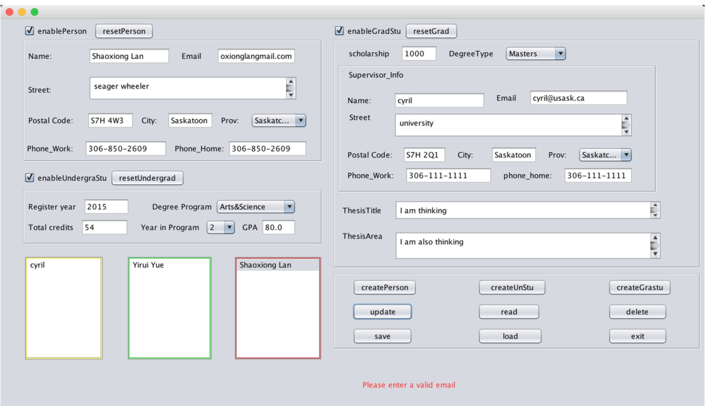
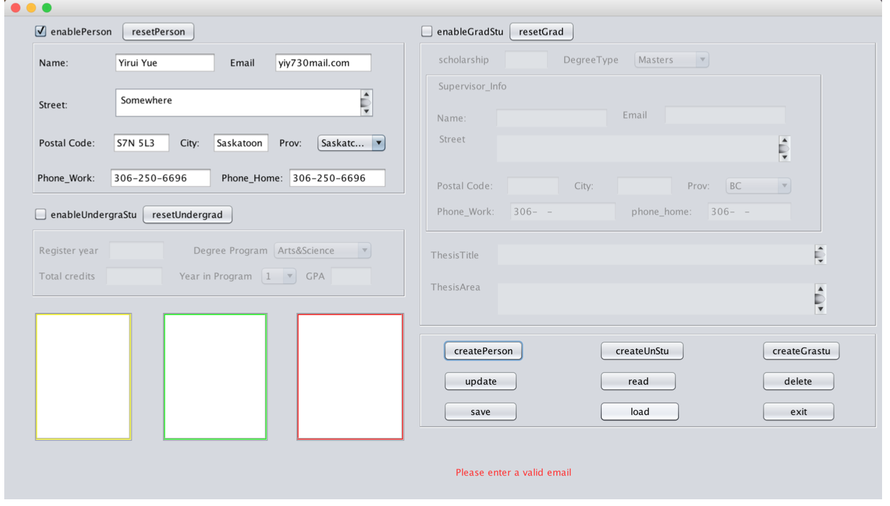
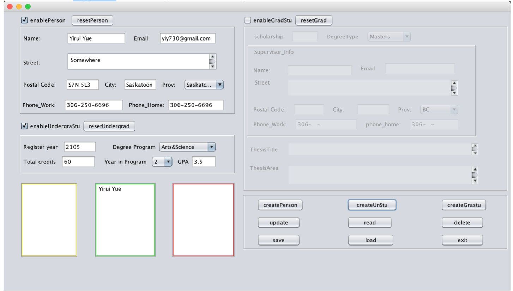
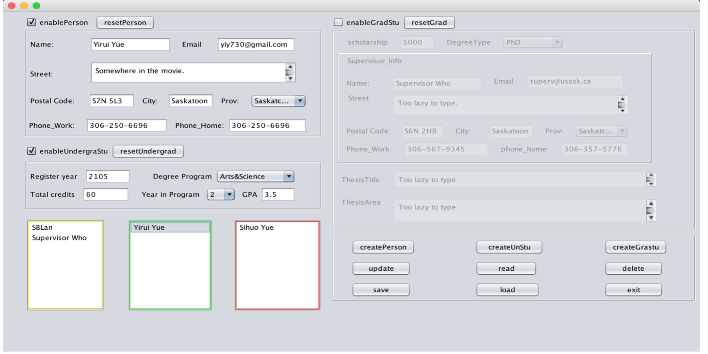
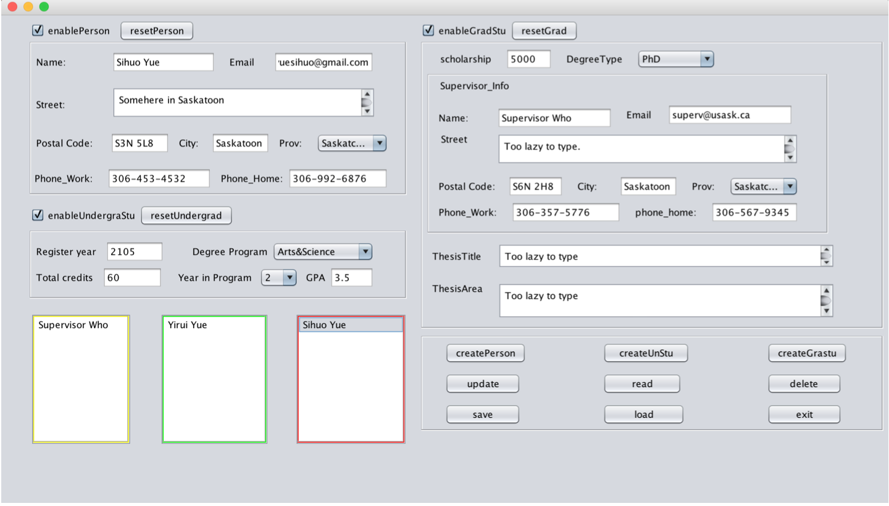
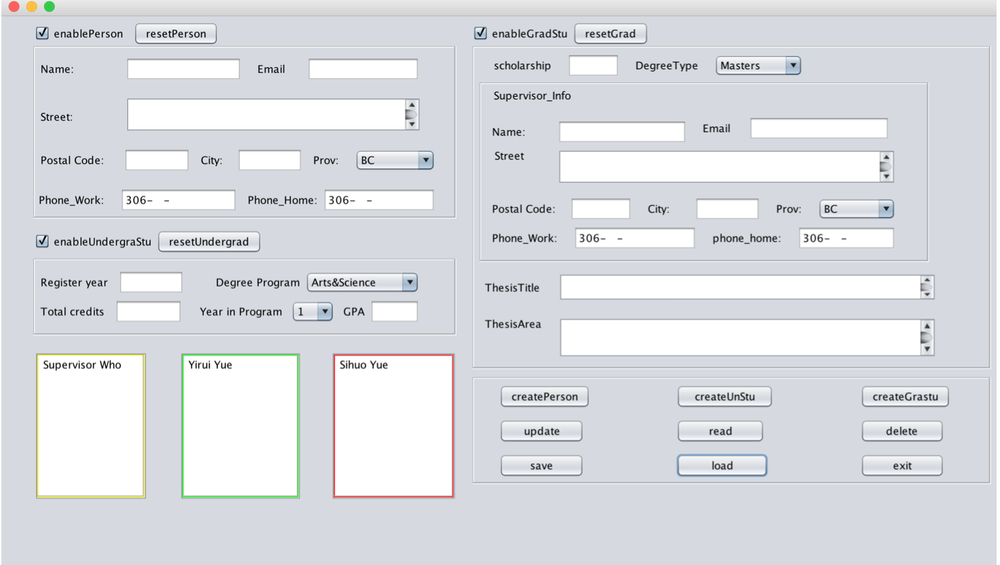

# personGUI
## Introduction
This is the project of course "Developing Object-Oriented Systems" (CMPT270), pair work with Yirui Yue. Based on the MVC architecture, we create the application to store, load and display person's infomation.

## Functions:
* Creating a new Person object while inputting invalid email address. The crate oepration should fail and an error message should appear.

* Creating an Undergraduate object with right input. The create operation should succeed and the name of the newly created student should appear on the green undergraduate list in the middle.

* Update operation: Change the street information stored from the previous step (test creating undergraduate), and related changes should appear.

* Delete operation. Delete an object from one of the lists, the name of the object should be removed from the related list and all the info stored in the object should be removed. Eg: deleting SBLan from the person list.

* Save, Exit and Load button. First we performed a Save operation. Then we clicked on exit to quit the program. Finally, we run the program again and performed a Load operation, the information originally stored should reappear, with only the name of the objects displayed in the lists.

